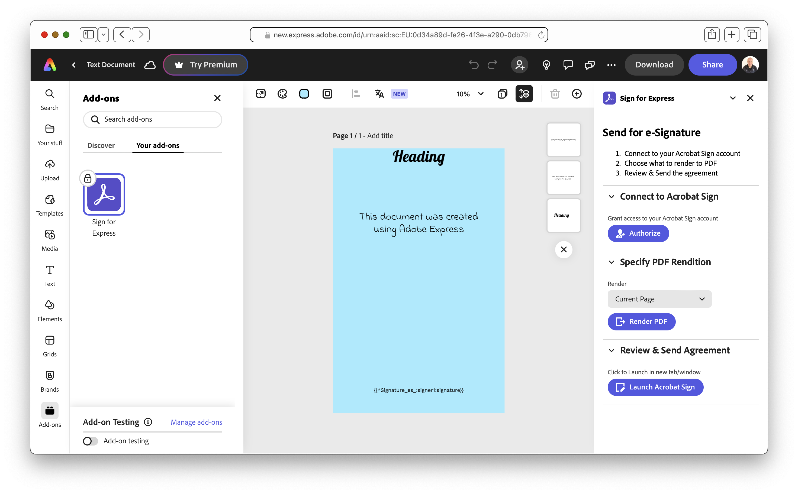

# Sign for Express

## Introduction
The [Sign for Express](https://www.e-sign.org.uk/sign-for-express/) add-on provides a simple integration with [Adobe Acrobat Sign](https://www.adobe.com/sign.html) within [Adobe Express](https://www.adobe.com/express/), to simplify the sending of an Express file for e-signature.

  

## Support
Please help to improve the add-on by filing issues and/or enhancements via the [issue list](https://github.com/esign-org-uk/sign-for-express/issues).

Please note that this add-on is a developed & maintained by a sole developer as a side project, so response times cannot be guaranteed.
